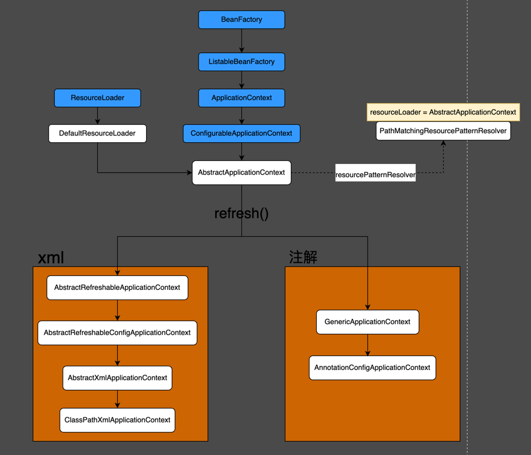

# 1. 入口：ClassPathXmlApplicationContext
```java
public class Main {
    public static void main(String[] args) {
        ApplicationContext applicationContext = new ClassPathXmlApplicationContext("classpath:spring-beans.xml");
        Student student = applicationContext.getBean("student", Student.class);
    }
}
```

```java
public class ClassPathXmlApplicationContext extends AbstractXmlApplicationContext {
    public ClassPathXmlApplicationContext(String configLocation) throws BeansException {
        this(new String[]{configLocation}, true, null);
    }

    public ClassPathXmlApplicationContext(
            String[] configLocations, boolean refresh, @Nullable ApplicationContext parent)
            throws BeansException {

        super(parent);
        setConfigLocations(configLocations);
        if (refresh) {
            refresh();
        }
    }
}
```

## 1.1 super(parent)


如图所示，一级一级往上访问直到AbstractApplicationContext类构造方法,里面做了两件事
1. 初始化AbstractApplicationContext的resourcePatternResolver = new PathMatchingResourcePatternResolver(this);
2. 设置父容器。由于parent为null，所以这里没有执行。   

```java
public abstract class AbstractApplicationContext extends DefaultResourceLoader
        implements ConfigurableApplicationContext {

    private ResourcePatternResolver resourcePatternResolver;

    private ApplicationContext parent;

    public AbstractApplicationContext(@Nullable ApplicationContext parent) {
        this();
        setParent(parent);
    }

    //this()
    public AbstractApplicationContext() {
        this.resourcePatternResolver = getResourcePatternResolver();
    }

    protected ResourcePatternResolver getResourcePatternResolver() {
        return new PathMatchingResourcePatternResolver(this);
    }

    public void setParent(@Nullable ApplicationContext parent) {
        this.parent = parent;
        if (parent != null) {
            //由于parent为null，所以这里的代码不执行
            Environment parentEnvironment = parent.getEnvironment();
            if (parentEnvironment instanceof ConfigurableEnvironment) {
                getEnvironment().merge((ConfigurableEnvironment) parentEnvironment);
            }
        }
    }
}
```

## 1.2 setConfigLocations(configLocations)
该方法继承自父类AbstractRefreshableConfigApplicationContext，用来将创建ClassPathXmlApplicationContext时传入的路径设置给configLocations变量。
```java
public abstract class AbstractRefreshableConfigApplicationContext extends AbstractRefreshableApplicationContext
        implements BeanNameAware, InitializingBean {
    
    private String[] configLocations;

    public void setConfigLocations(@Nullable String... locations) {
        if (locations != null) {
            Assert.noNullElements(locations, "Config locations must not be null");
            this.configLocations = new String[locations.length];
            for (int i = 0; i < locations.length; i++) {
                //该方法的主要业务
                this.configLocations[i] = resolvePath(locations[i]).trim();
            }
        } else {
            this.configLocations = null;
        }
    }

    protected String resolvePath(String path) {
        /*
        * getEnvironment()方法继承自父类AbstractApplicationContext，返回new StandardEnvironment()
        * 而AbstractEnvironment是StandardEnvironment的父类，因此先被加载并初始化
        * AbstractEnvironment实例化时会先初始化（propertySources与propertyResolver两个属性）
        * 
        * resolveRequiredPlaceholders(path)方法是最终PropertySourcesPropertyResolver.
        *  
        */
        return getEnvironment().resolveRequiredPlaceholders(path);
    }
}
```

```java
public class StandardEnvironment extends AbstractEnvironment {
    protected void customizePropertySources(MutablePropertySources propertySources) {
        propertySources.addLast(
                new PropertiesPropertySource(SYSTEM_PROPERTIES_PROPERTY_SOURCE_NAME, getSystemProperties()));
        propertySources.addLast(
                new SystemEnvironmentPropertySource(SYSTEM_ENVIRONMENT_PROPERTY_SOURCE_NAME, getSystemEnvironment()));
    }
}
```

resolveRequiredPlaceholders(path)方法在StandardEnvironment类中没有，而是继承自父类AbstractEnvironment
```java
public abstract class AbstractEnvironment implements ConfigurableEnvironment {
    //new MutablePropertySources()
    private final MutablePropertySources propertySources;

    //new PropertySourcesPropertyResolver(propertySources)
    private final ConfigurablePropertyResolver propertyResolver;

    public AbstractEnvironment() {
        this(new MutablePropertySources());
    }
    
    /**
    * 1. 初始化 this.propertySources = new MutablePropertySources()，且MutablePropertySources的propertySourceList属性中包含systemProperties与systemEnvironment
    * 2。初始化 this.propertyResolver = new PropertySourcesPropertyResolver(propertySources)
    */
    protected AbstractEnvironment(MutablePropertySources propertySources) {
        //this.propertySources = new MutablePropertySources()
        this.propertySources = propertySources;
        //this.propertyResolver = new PropertySourcesPropertyResolver(propertySources)
        this.propertyResolver = createPropertyResolver(propertySources);
        //由子类StandardEnvironment实现该方法
        //子类逻辑：将systemProperties与systemEnvironment两个properties添加到AbstractEnvironment类的变量propertySources的List<PropertySource<?>> propertySourceList中
        customizePropertySources(propertySources);
    }

    protected ConfigurablePropertyResolver createPropertyResolver(MutablePropertySources propertySources) {
        return new PropertySourcesPropertyResolver(propertySources);
    }

    protected void customizePropertySources(MutablePropertySources propertySources) {
        //模版方法，由子类StandardEnvironment实现
    }
    
    public String resolveRequiredPlaceholders(String text) throws IllegalArgumentException {
        return this.propertyResolver.resolveRequiredPlaceholders(text);
    }
}
```

## 1.3 refresh()

